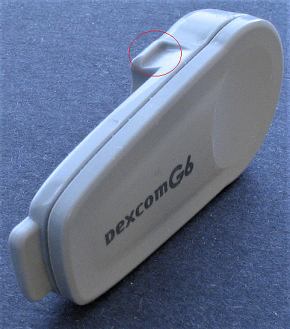
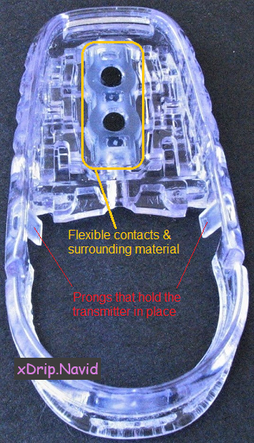
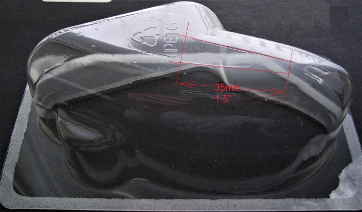
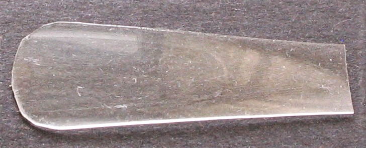
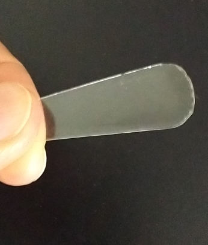
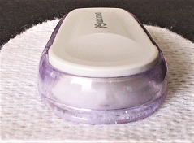
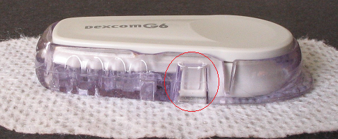
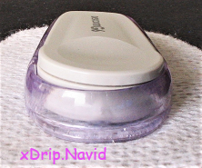

## Removing a G6 transmitter without damaging the sensor
[xDrip](../README.md) >> [Features](./Features_page.md) >> [xDrip & Dexcom](./Dexcom_page.md) >> Remove G6 transmitter  
  
Under normal circumstances, after you peel off the sensor with the transmitter inside, you can open the sensor, remove the transmitter and throw away the sensor.  
This guide explains how you can remove the transmitter leaving the sensor intact and still attached to you.  
  
A G6 transmitter is shown in the following figure, in which the sensor prong latch is marked.  
  

A sensor is shown in the following figure.  
    

The flexible material puts pressure on the transmitter.  When snapping in the transmitter, the resistance you sense is from this material.  
When the transmitter is properly seated into the sensor, the two sensor prongs latch into the sides of the transmitter, and the contacts and their surrounding material keep the transmitter tightly in place.  

To remove the transmitter, we need to gently push the prongs away from the transmitter.  We can do that using a very thin but sturdy object.  The following shows how you can use the plastic packaging of a sensor for creating such a tool.

Use scissors to cut the section highlighted in the following figure from the top of a G6 sensor plastic package.  
  

Use sharp scissors to round the two corners.  Now, we have our tool.  Please keep away from children, or pets, as this is small and can be a choking hazard.  
  
  

The following figure shows an image of the transmitter snapped into the sensor.  
  

You can see the prong snapped in in the following figure.  
  

If you gently insert the larger end of the plastic strip, with rounded corners, between the sensor and transmitter where the prong is located, the prong will release as shown in the next figure.    
  

This is because of the compressed flexible material between the sensor and the transmitter.  The material pushes the transmitter away from the sensor.  This is why it is enough to just release the prong.  Then, the transmitter is tilted and the prong will never snap back in unless you apply pressure on top of the transmitter, which you shouldn't if you want to remove the transmitter.  

The following clip shows how the transmitter can be removed using the tool we created.  Gently insert the plastic strip between the transmitter and the sensor on one side as shown until you hear or feel a click.  
Then, do the same on the other side.  

<video width="400" controlsList="nodownload" src="./videos/Remove-G6-TX.mp4" controls>  
</video>  
   
  
If you need to remove the transmitter, don't touch the contacts on the transmitter or sensor and avoid wearing tight clothing over the sensor so that [Petroleum jelly](./Petroleum-jelly-in-Dexcom-G6-Sensor.md) is not accidentally wiped away.     
