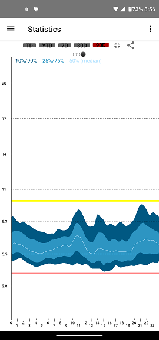

## Report  
[xDrip](../README.md) >> [Features](./Features_page) >> Report  
  
This explains how you can create a report for your endocrinologist.  

In xDrip, tap on [Statistics](./Statistics.md) from the top left menu button. You can swipe left or right to access a total of 3 pages. The first and the last pages are the ones you need for a report.  
But, before creating images, pay attention to the red and yellow lines shown on screen.  Those represent your low and high values.  You can adjust those under Settings &#8722;> Glucose Units.  However, please note that those settings affect statistics as well as your persistent high and forecast low alerts.  Therefore, if you adjust them for your report, remember to go back and return them to the values you need for your alerts.  The standard values for statistics (report) for your low and high levels are 70mg/dL (3.9mmol/L) and 180mg/dL (10mmol/L).  With those set to standard values, return to statistics.  
At the top, tap on 90D for the past 90 days.  
Tap on the 3-dot menu and select "Colors for printing".  This will change the background color to white.  You will now see something like this:  
  
  
Tap on share or create a screenshot.  Email it to yourself or place it on your Google Drive.  
Swipe right twice to go to the statistics distribution page.  Share that as well and send to yourself.  
  
Alternatively, you can create the two images from [Nightscout](./Nightscout-page.md).  In that case, choose "Reports" from the Nightscout menu.  Then, use "Percentile Chart" and "Distribution" to create the two images.  Make sure to choose a 3-month period up to now.  
  
Create a document using your favorite word processor. On the first page, enter your name, contact details, date, and doctor's name.  
Enter the names of your insulin types and how much you take from each.  
  
Import the graph you emailed to yourself. Add the date range. Also include your Low Value and High Value (which you can find under Settings, Glucose Units) if you are using images from xDrip.  If you are using images from Nightscout, the parameters are already included in the image.    
Import the other page you emailed to yourself, containing all the parameters, as well. Add the date range for this image as well.  
  
Now print this document into a PDF file.  
You can provide this as your report to your Endocrinologist.  
  
This (with images from xDrip) only works if you have been using xDrip consistently for the past 3 months on the same device.  
Otherwise, the data in xDrip may not cover all your readings from the past 3 months. In which case, you need to first gather all the data in one database. [Nightscout](./Nightscout_page.md) is one option.  
  
