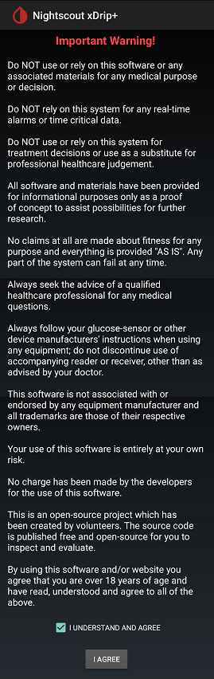

# Requirements  
[xDrip](../) >> [Download & Installation](./Installation_page.md) >> Requirements  
  
xDrip is only a piece of software, and it may malfunction.  
Even if it works exactly as intended, it should never be relied upon as the primary controller.  
You are the one responsible for making decisions, and you should always consult a qualified medical professional when managing your (or your loved one’s) diabetes.  
  
  
  
#### [No medical decisions](./Medical.md)
#### [Phone](./Smartphone-Requirements.md)
#### [Location Access](./Location.md)
  
