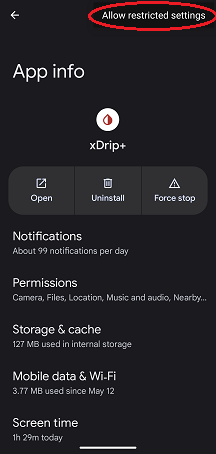
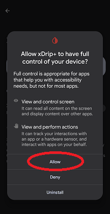

## Allow Restricted Settings
[xDrip](../README.md) >> Allow Restricted Settings  
  
Some features require access to restricted settings on your phone depending on the Android version.  
To grant that permission, follow the instructions on this page.  
  
- Navigate to xDrip app info under Android Settings.  
- From the 3-dot menu at the top right, select `Allow restricted settings`.  
  
  
- Approve the confirmation request.  
  
  
  
