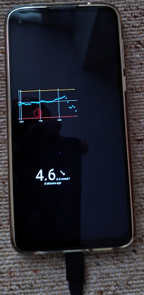

## Screensaver
[xDrip](../README.md) >> [Features](./Features_page) >> [Display](./Display/Display) >> Screensaver  
  
You can set xDrip as the screen saver on your phone.  
Then, when it is being charged, you can see your readings on screen continuously even when the phone is locked.  
  
  
You need to set this in Android, not xDrip itself.  
  
If you don't see xDrip as an option, as shown below, you need to tap on the current screen saver.  
  
It should let you choose xDrip.  
  
