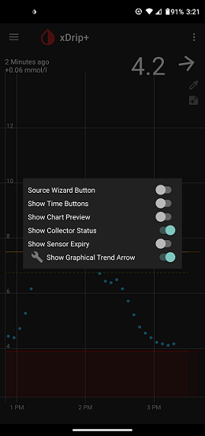

## Sensor Expiry  

xDrip doesn't have an alert warning you about sensor expiry as it approaches.  

However, you can have it show when the sensor expires at the bottom of the main screen.  
To do that, long press the xDrip icon on the main screen.  You will see something like this:   
Enable "Show Sensor Expiry".  
