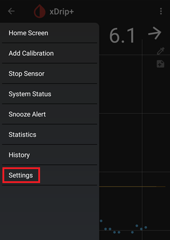
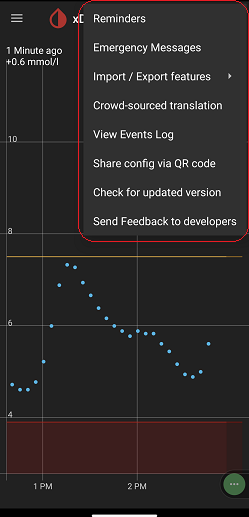

## xDrip Settings
[xDrip](../README.md) >> [FAQ](./FAQ_page.md) >> Settings  
   
  
---  
  
#### **Main settings**  
To access xDrip's main settings, tap on the 3 horizontal lines at the top left of the main screen and tap on Settings as shown below.  
  
  
  
  
  
   

---  

#### **3-dot menu**  
Some controls are under the 3-dot menu.  
  

  
  
  
