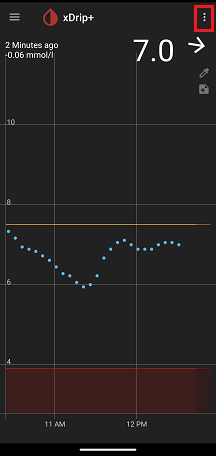

## xDrip Settings
[xDrip](../README.md) >> [FAQ](./FAQ_page.md) >> Settings  
   
  
---  
  
#### **Main settings**  
To access xDrip's main settings, tap on the 3 horizontal lines at the top left of the main screen and tap on `Settings` as shown below.  
  
  
  
  
  
   

---  

#### **3-dot menu**  
Some controls are under the 3-dot menu.  
  

  
   
  
---  

#### **Home shelf**  
Some settings are accessible under the [Home shelf](./HomeShelf.md).  
   
  
---  
  
#### **Voice commands (Advanced)**  
There are some commands that can only be accessed as voice commands.  
A voice command is not meant to be easy to enter.  Commands that are accessible as voice commands are commands that are not supposed to be needed under normal operating conditions.  An example is enabling engineering mode.  You shouldn't really need to enable it if you are an xDrip user and not a developer.  
Clearing the Dexcom queue is another example.  If you follow the guidelines for using xDrip as a Dexcom collector, you will never need to clear the queue.  
  
Tap on the dropper symbol on the main screen.  
  
  
Long press on the microphone symbol. A form will open up.  
  
  
Type and enter the voice command in it.  

  
