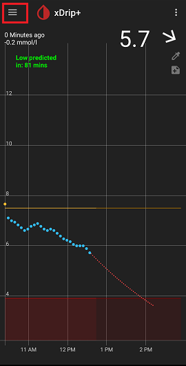
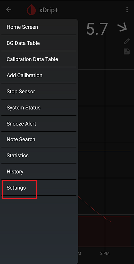
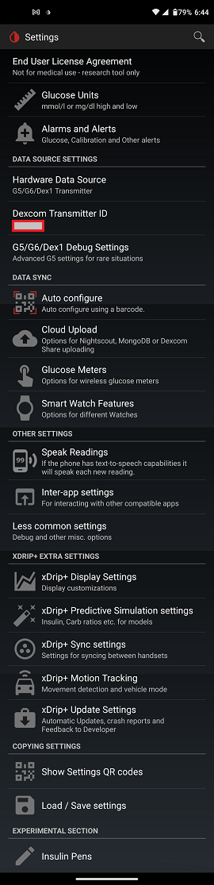

  
# xDrip Main Settings
[xDrip](../../) >> [Settings](../Settings.md) >> Main settings or main menu or hamburger menu  
   
  
To access xDrip's main settings, tap on the 3 horizontal lines at the top left of the main screen and tap on `Settings` as shown below.  
  
  
  
  
  
  
  
