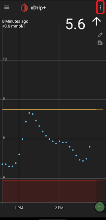
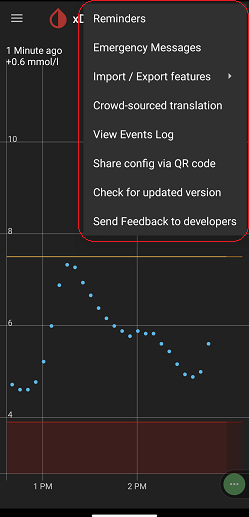

  
# xDrip more settings  
[xDrip](../../) >> [Settings](../Settings.md) >> More settings or vertical ellipsis menu or 3 dots menu  
   
  
Some controls are under the vertical ellipsis menu.  
  

  
   
  
The contents of the vertical ellipsis menu can be different depending on what page you are on.  
  
