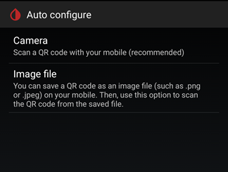

## Read QR Code
[xDrip](../README.md) >> [Settings](./Settings.md) >> Scan QR Code  
  
xDrip can scan a QR code containing xDrip settings to import them.  
To do that, go to `Settings` &#8722;> `Auto Configure`.  
  

Most Android devices have a camera.  Tap on the top button (Camera) to scan using the camera.  
It may help to rotate the phone to be in landscape mode while scanning.  
It may help to move the phone back from the QR code to allow the camera to better focus.  
After xDrip scans, it will show you the settings that are included in the QR code and asks you to confirm to import them.  
   
  
---  

Your device may not have a camera.  Or, the camera may be broken.  Or, the only way to access the QR code may be to bring it up on the same device that is running xDrip.  
In those cases, you can use an alternative method for scanning the QR code as explained here.  
First, you need to save the QR code as an image file on your device.  To do that, use a browser on your device and access the QR code.  Long press on the QR code image.  The browser must give you the option to save the image.  Do that.  By default, the image will be saved in your Downloads folder.  

After having saved the QR code image file on your phone, use the button at the bottom, `Settings` &#8722;> Auto Configure &#8722;> `Image file`.  
Find the image file that you saved and select it.  
After xDrip scans, it will show you the settings contained in the QR code and asks you to confirm to import them.  

  
