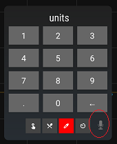

# xDrip voice commands  
[xDrip](../../) >> [Settings](../Settings.md) >> Voice commands  
   
  
Some features in xDrip are accessible only through voice commands.  These commands are designed for situations outside normal usage and are typically not needed by regular users.  For example, enabling Engineering Mode is primarily for developers, not standard users.  Similarly, clearing the Dexcom queue is unnecessary if you follow xDrip's guidelines for using it as a Dexcom collector.  
   
  
#### **How to Use Voice Commands:**
1- Tap the dropper icon on the main screen.  
  
  
2- Long press the microphone icon.  
  
A form will appear.  
  
3- Type and submit the desired voice command.  

  
