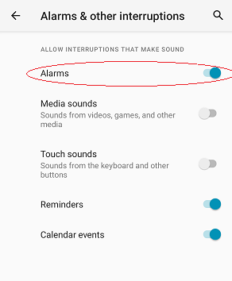

## xDrip Alert makes no sound
[xDrip](../README.md) >> [Features](./Features_page) >> [Alerts](./Alerts_page) >> [Alert makes no sound](./Silent-alert)  
  
Different factors could result in an alert not making any sound.  The following is a list of such combinations.

1- The alert is on the [Glucose Level Alerts List](./Glucose-level-alerts.md) and you have chosen the silent [volume profile](./Volume-profiles.md).  
  
2- The phone is in "Do Not Disturb" mode and the "override silent mode" setting is not enabled for the alert.  The missed reading alert inherits its sound file and override silent mode from the "Other Alerts" (Settings &#8722;> Alarms and Alerts &#8722;> Other Alerts).  
  
3- The alert is not on the [Glucose Level Alerts List](./Glucose-level-alerts.md) and the phone "ring & notification" volume is set to 0.  
  
4- The [notification channels](./Notification-channels.md) setting is enabled and the Android notification channel corresponding to the alert has been set to be silent.  
  
5- Android is not set to exclude Alarms from do not disturb.  To remedy this, enable Android Settings &#8722;> Sound &#8722;> Do Not Disturb &#8722;> Alarm & other interruptions   
  
  
If an alert doesn't trigger, you cannot expect it to make a sound.  Every alert has some trigger conditions. When an alert triggers, a log is created including the alert title and the time it triggered.  If the alert triggers and you can see the log but cannot hear it, and the above list does not explain the behavior, take a snapshot of the log to include with your request for help.   
