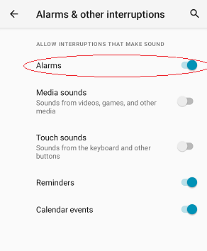
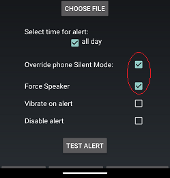

# Why xDrip Alert makes no sound
[xDrip](../) >> [Features](./Features_page.md) >> [Alerts](./Alerts_page.md) >> xDrip Alert makes no sound  
  
Different factors could result in an xDrip alert not making any sound.  The following is a list of such combinations.  
Some Android settings may not be located exactly as shown on all phone brands.  
  
1- You have chosen the silent [volume profile](./Volume-profiles.md).  
  
2- The phone is in `Do Not Disturb` mode, and Android is not set to exclude Alarms from do not disturb.  To remedy this, enable Android `Settings` &#8722;> `Sound` &#8722;> `Do Not Disturb` &#8722;> `Alarm & other interruptions` &#8722;> `Alarms`  
  
  
3- The phone is in `Do Not Disturb` mode and the `override silent mode` and `Force speaker` settings are not enabled for the alert.  
  
  
   
  
---  
  
When an alert triggers, a log is created including the alert title and the time it triggered.  If the alert triggers and you can see the log but cannot hear it, and the above list does not explain the behavior, take a screenhot of the log to include with your request for help.  
  
