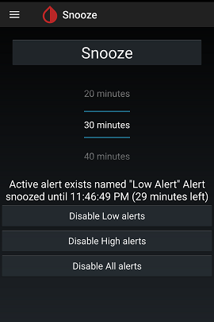
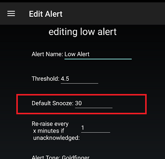
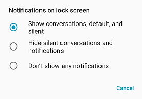

## Snooze  
[xDrip](../README.md) >> [Features](./Features_page.md) >> [xDrip Alerts](./Alerts_page.md) >> Snooze xDrip  
  
When you snooze an alert, you silence it for a period of time.  If you use the snooze menu for snoozing an alert, you are given the option of how long to snooze it for.  
  
  
If the cause of the alert is addressed before the snooze period ends, the alert will not continue after the snooze period ends.  
  
But, there is a much easier way to snooze an alert by just swiping right the associated notification.  Snoozing an alert this way, snoozes it for default snooze time.  
The default snooze time for every Glucose level alert can be set on its edit alert page.  
  
  
If you want to be able to snooze an alert the same way with the screen locked, go to Android Settings &#8722;> Apps & notifications &#8722;> Notifications &#8722;> Notifications on lock screen.  You will see 3 options.  They will have different wordings depending on the manufacturer.  The following image shows an example:  
  
  
Choose the least restrictive option.  
  
Also, in xDrip, enable Settings &#8722;> xDrip+ Display Settings &#8722;> Public Notifications.  
  
Now, the notification can also be swiped right on the lock screen to snooze the alert.  
  
If you want the lock screen to automatically show when an alert triggers, without having to press on the power button, enable Settings &#8722;> Alarms and Alerts &#8722;> Glucose Alerts Settings &#8722;> Wake Screen.  
  
There is no need to open xDrip and access the "Snooze Alert" item from the menu unless you need to choose a snooze period different from the default.  
  
