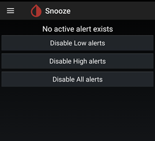
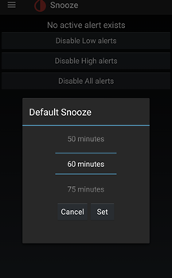
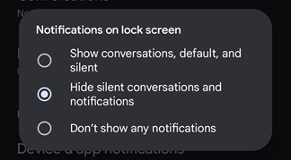

## Snooze  
[xDrip](../README.md) >> [Features](./Features_page.md) >> [xDrip Alerts](./Alerts_page.md) >> Snooze xDrip  
  
When you snooze an alert, you silence it for a period of time.    
If the cause of the alert is addressed before the snooze period ends, the alert will not continue after the snooze period ends.  

---  
  
#### **Snooze a triggered alert**  
You can use the snooze option from the xDrip main menu (top left) for anoozing an alert.  
Then, you are given the option of how long to snooze it for.  
  

But, there is an easier way to snooze an alert by just swiping right the associated notification.  Snoozing an alert this way, snoozes it for default snooze time.  
The default snooze time for every Glucose level alert can be set on its edit alert page.  
  
  
   
  
---  

#### **Preemptive snooze**  
If you have already taken insulin to treat a high or if you have already eaten something to treat a low, you may want to snooze the corresponding alerts before they even trigger for a short while.  
In that case, you can snooze low or high alerts before they even trigger.  
To do that, choose the Snooze menu from the main xDrip menu at the top left corner of the main screen.  
  

Tap on one of the three disable alert options.  In the menu that comes up, choose the length of time to snooze the alerts for and tap on Set.  
  
  
Now, alerts will not trigger until that set time passes.  
  
   
  
---  

#### **Snooze while the screen is locked**  
If you want to be able to snooze an alert the same way with the screen locked, go to Android `Settings` &#8722;> `Apps & notifications` &#8722;> `Notifications` &#8722;> `Notifications on lock screen`.  You will see 3 options.  They will have different wordings depending on the manufacturer.  The following image shows an example:  
  
  
Choose the option that allows notifications to be shown.  
   
  
This should be all you need.  
But, if it doesn't work, in xDrip, enable `Settings` &#8722;> `xDrip+ Display Settings` &#8722;> `Public Notifications`.  In that case, please [let me know](./Contact.md).  
  
Now, the notification can also be swiped right on the lock screen to snooze the alert.  
  
If you want the lock screen to automatically show when an alert triggers, without having to press on the power button, enable `Settings` &#8722;> `Alarms and Alerts` &#8722;> `Glucose Alerts Settings` &#8722;> `Wake Screen`.  
   
  
