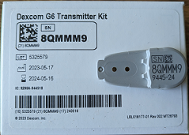

## Starting Dexcom G6 or Dexcom ONE
[xDrip](../README.md) >> [Features](./Features_page.md) >> [xDrip & Dexcom](./Dexcom_page.md) >> Starting G6 or Dexcom ONE  
  
Please be patient and do not rush to tap on "Start Sensor" even if xDrip encourages you to.  Please follow the steps exactly as stated below, in the specified sequence, to avoid common issues.  
If you see references here to functions you don't recognize, please have a look at [this](./Dexcom-Basics.md).  

To start, you will need a transmitter, a sensor, and an Android phone.  
If you have already read this page and have started a sensor, and need information on how to stop it and start the next sensor, please read [this](./Dexcom/StartG6Sensor.md).  
   

---  

#### **Transmitter**  
If you are using a brand new transmitter, you will need to activate it.  It will be activated when you snap it into the sensor.  Or, you can activate it as explained [here](./Dexcom/NewG6TX_Activation.md).  
You will need the serial number of the transmitter, which is shown on the bottom of the transmitter and on the transmitter box as shown in the following image.  
  
The serial number of the transmitter shown above is 8QMMM9.  
Take a note of your transmitter serial number.  You will need it possibly for the next 110 days.  
  
   
  
---  
  
#### **Sensor**  
Don't open the sensor container until you are ready to insert it.  
Every sensor has a 4-digit calibration code as shown in the following image.  You will need that code, from your sensor, to start a session.  
  
  
   
  
---  

#### **xDrip**  
You cannot use xDrip and Dexcom app both as collectors.  So, you should uninstall Dexcom app.  
  
1. Unless otherwise advised by an xDrip developer, [download](./Download-xDrip.md) and [install](./Install.md) the current stable release of xDrip.  
If you already have xDrip installed and are using an older version, you can [update](./Updates.md).  
  
2.  Set `G5/G6/G7/1 Transmitter` under &nbsp; `Settings` &#8722;> [`Hardware Data Source`](./HardwareDataSource.md).  
  
3.  Is there a `Start G6 Sensor` stuck in the queue on the G5/G6/G7 status page?  Please note that in the last step when you start sensor, there will be a `Start G6 Sensor` in the queue for one read cycle (up to 5 minutes).  That is expected and does not count as a stuck command.  A stuck command remains in the queue and does not clear.  
  
If there is a command stuck in the queue, [clear the queue](./Clear-queue.md).  
  
4.  Adjust xDrip [settings](./G6-Recommended-Settings.md).  If you get a pair request at any point, please approve.  
  
5.  If "Start Sensor" isn't available as an option from the top left menu on the main screen, "Stop Sensor" from the same menu.  Wait 5 minutes.    
The transmitter needs to be detached from your body for at least 10 minutes before you proceed.  More on this [here](./Dexcom/StartG6Sensor.md).  
If there is bleeding, after inserting a new sensor, use Q-tips to absorb the blood.  Keep doing that, and don't allow any blood to get to the contacts, until bleeding stops.  
  
6.  If you are starting a new transmitter, enter the new transmitter serial number (Transmitter ID): `Settings` &#8722;> `Dexcom Transmitter ID`.     
  
7.  Clean the transmitter contacts (not if you are restarting sensor) using rubbing alcohol.  Wait for it (10 seconds) to dry.  Snap the transmitter into the sensor.  If you are starting a new transmitter, snapping it into the sensor on your body is required to activate it.  
  
8.  Monitor the G5/G6/G7 system status page. Every 5 minutes, a read cycle completes.  
If you don't have [proper connectivity](./Proper-connectivity.md), don't proceed before figuring out why. Perhaps, your settings are incorrect.  
If you are starting a new transmitter, be patient and wait for the battery voltages to be populated before you proceed. It may take up to half an hour.  
  
9.  Start sensor.  Enter the 4-digit calibration code from the sensor adhesive cover when asked. Keep the code. In 2 hours, your readings will start with no need for initial calibrations.
  
   
  
---  
  
To see all the guides and notes about using xDrip for Dexcom, please see [this](./Dexcom_page.md) page.  If you have a question that is not covered, please [tell](./Contact.md) us.  
  
If you are coming from G5, or another CGM, you need to get used to factory calibration.  Give it a chance.  Most people don't need to calibrate G6 as long as the calibration code is entered properly.    
  
Never soak (insert sensor a while before starting it) a G6 sensor. The main advantage of G6 over G5 is factory calibration. You will be interfering with factory calibration (accuracy) the longer it takes from the moment you insert the sensor to the moment you start the sensor in xDrip.  
   
  
