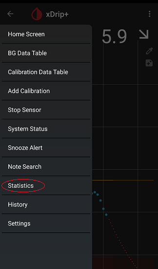
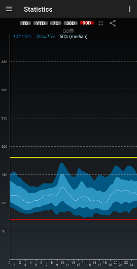

## xDrip Statistics  
  
xDrip stores previous readings and performs statistical analysis on them.  
To access statistics, tap on "Statistics" from the top left menu button.  
  
  
Now, you can swipe left or right to access a total of three different pages.  
The page on the left contains all the statistical parameters.  
  
The page in the middle is a pie chart representing the percentage of time in range, high and low.  
  
The page on the right contains an AGP (Ambulatory Glucose Profile).  
  
  
At the top, you can choose TD for today, YTD for yesterday, 7D for the last 7 days, 30D for the last 30 days, and 90D for the past 90 days.  

The AGP graph, set to 90D, is very informative of your overall control and very useful for your endocrinologist as well.  So are the parameters on the first page.  
