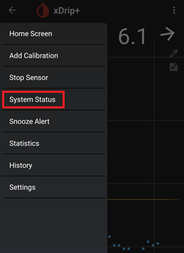
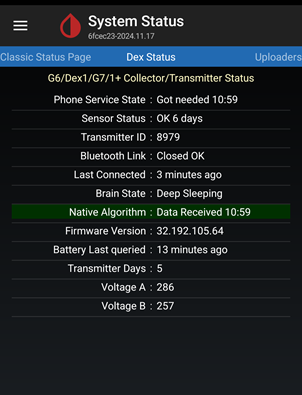

## Dex Status Page
[xDrip](../README.md) >> [Features](./Features_page.md) >> [Dexcom](./Dexcom_page.md) >> Dex Status  
  
To get to the status pages, tap on the top left menu button on the main screen and choose "System Status".  
  
  
Now, you can swipe left or right to access different status pages.  
Each status page has a heading.  
  
If you are using xDrip as the collector from a Dexcom device, go to the Dex status page with the "Dex Status" heading.  
  
  
  
  
  
For G6 or Dexcom ONE, The transmitter ID shown on this page is unique to your transmitter and can be used to interfere with your system.  Be careful with whom you share it.  You can blackout the transmitter ID before posting a screenshot of this page on a forum as no one needs to see it in order to help you.  
  
