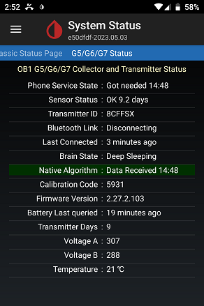

## G5/G6 Status Page
[xDrip](../README.md) >> [Features](./Features_page.md) >> [Dexcom](./Dexcom_page.md) >> [Status](./StatusG5G6.md)  
  
To get to the status pages, tap on the top left menu button on the main screen and choose "System Status".  Now, you can swipe left or right to access different status pages.  
Each status page has a specific heading at the top.  
  
If you are using xDrip as the collector from DExcom G5, or G6 or DExcom One, go to the G5/G6 status page with the "G5/G6 Status" heading.  
  
  
