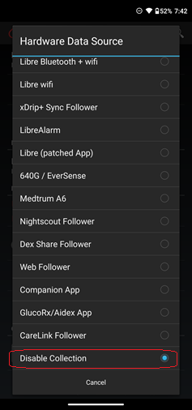

  
## Disable Collection  
[xDrip](../) >> [Features](./Features_page.md) >> Disable collection  
  
If you want to stop using xDrip without uninstalling it, you can disable collection. To do this, follow these steps:  
  
* Go to `Settings` &#8722;> `Hardware Data Source`.  
  
* Make a note of the current setting so you can revert it later if needed.  
  
* Scroll all the way down and tap on `Disable Collection`.   
  
    
To re-enable xDrip, go back to Hardware Data Source and select the collection system you were using before.    
  
