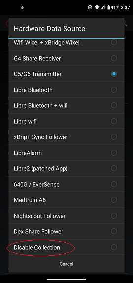

## Disable Collection  
  
If you want to stop using xDrip without uninstalling it, you can disable collection.  
To do that, go to Settings &#8722;> Hardware Data Source.  
Make a record of the current setting so that you remember in case you want to undo this.  
Scroll all the way down, and tap on "Disable Collection".  
  

To reenable xDrip, go back to Hardware Data Source and choose the collection system you were using before. For example, if you were using G5 or G6, that would be "G5/G6 Transmitter".  
