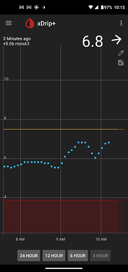

## xDrip Time Buttons  
[xDrip](../README.md) >> [Features](./Features_page.md) >> [Display](./Display/Display.md) >> Time Range  
  
Bring up the [home shelf](./HomeShelf.md).   
  
On it, enable `Show Time Buttons`.  Now, you will see something like this:  
  
  
If you long press any of the time buttons, xDrip will maintain that for the time range shown on screen.  
  
If you like this feature but like to remove the time buttons from the screen, you need to also enable `Locked Time Period Always Used`.  Now, xDrip will remember the time button you long pressed even after you remove the time buttons from the screen.  
  
