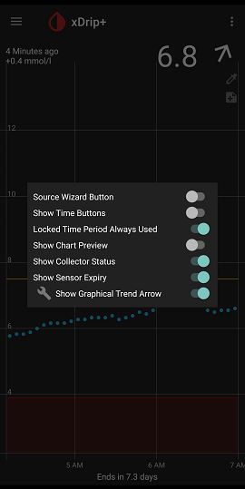

## xDrip Time Buttons  
  
Long press the xDrip icon on the main screen to bring up the home shelf menu.  
  
  
On it, enable "Show Time Buttons".  
If you long press any of the time range buttons, xDrip will maintain that for the time range shown on screen.  
  
If you like this feature but like to remove the time buttons from the screeb, you need to also enable "Locked Time Period Always Used".  Now, xDrip will remember the time button you long pressed.  
