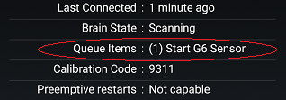

## Dexcom Transmitter Queue  
[xDrip](../README.md) >> [Features](./Features_page) >> [xDrip & Dexcom](./Dexcom_page) >> [Dexcom Transmitter Queue](./Transmitter-Queue)  
  
The transmitter is only active once every 5 minutes for a very short period of time.  During the rest of the time, the transmitter is silent and inactive.  Otherwise, the batteries would not last as long as they do.  
  
When you issue a command, from xDrip, the command enters a queue and waits for the next connectivity time slot.  The main commands are "Start Sensor", "Stop Sensor" and "Calibrate".  
If there is an item in the queue, you can see the queue on the G5/G6 status page.  
  

As long as you can see an item in the queue, the transmitter has not received the corresponding command.  Therefore, you should not issue another command.  
But, more importantly, you should not issue a command if there is no proper connectivity with the transmitter.  
