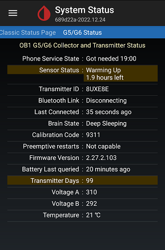
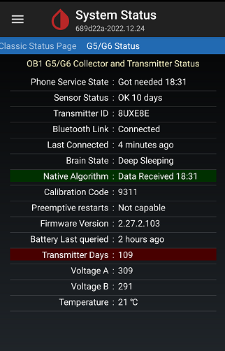

---
title: "Dexcom Transmitter Lifetime"
description: "Learn how xDrip tracks Dexcom transmitter lifetime, what Transmitter Days mean, and when you can start or restart a sensor."
layout: ""
---  
  
# Transmitter Lifetime
[xDrip](../) >> [Features](./Features_page.md) >> [Dexcom](./Dexcom_page.md) >> Transmitter Lifetime  
  Transmitter Days  
  
Only start the transmitter counter if you intend to use the transmitter. The counter begins as soon as the transmitter is inserted into a sensor. It can even start if you hold the transmitter in your hand while touching the contacts for an extended period.  
For this reason, it is best to keep the transmitter in its box until you are ready to start using it.  
  
The last day you can start (or restart) a sensor on a transmitter is when the System Status page shows 99 for transmitter days.  
The transmitter days color on the Status page is important:  
- When you first start using a transmitter, no color is shown.  
- The value turns brown when there are 30 days remaining before the last day you can start a sensor.  
- The value turns red when you can no longer start a new sensor.  However, if you already have a session in progress, it will continue to run even though the value is red.  
  
The image below shows Transmitter Days at 99 with the warning color applied.  
  
  
The image below shows Transmitter Days at 109 in red, indicating that you can no longer start a new sensor.  
  
  
  
