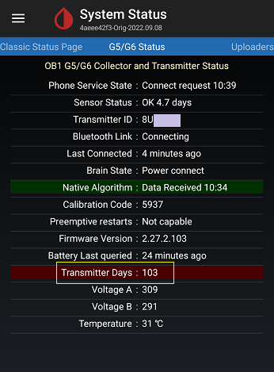

## Transmitter Lifetime
[xDrip](../README.md) >> [Dexcom](./Dexcom_page) >> [Transmitter Lifetime](./Transmitter-lifetime)  
  Transmitter Days
  
You can use a G5 as long as it has battery.  This is because you can [hard reset](./Hard-Reset.md) a G5.  

You can also hard reset a G6 if its firmware is 1.6.5.25 or older.  That includes transmitters with the first two characters of the serial number being 80 and some of the ones with the first two characters being 81.  

You cannot hard reset the other G6 transmitters.  So, only start the counter if you intend to use the transmitter.  The counter starts counting as soon as you insert the transmitter in a sensor.   So, it's best to keep the transmitter in the box until you intend to start using it.  

The last day you can start (or restart) a sensor on a transmitter in [native mode](./Native-Algorithm.md) is when the system status page shows 99 (105 for G5) for "Transmitter Days".  
  
  
  
After you successfully start a sensor, it will work for 10 days (7 days for G5 in native mode).  

Hard resetting a transmitter does nothing to the battery.  If the battery is dying, you will need to replace the battery.  
