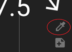
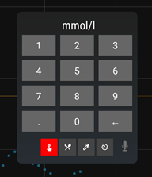
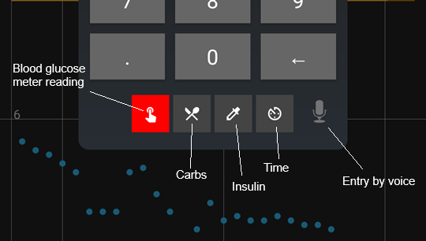

# Treatments
[xDrip](../) >> [FAQ](./FAQ_page.md) >> Treatments  

To access the treatment menu, tap on the dropper symbol on the main screen.  
  
  
This will bring up the treatment menu.  
  
  
In the menu, you can find the options to enter a blood glucose meter result, carbs, insulin, and time.  You can also enter a treatment by voice by tapping on the microphone symbol.  
  
  

  
