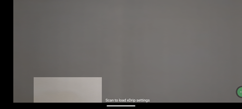
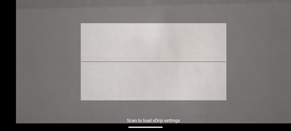

## Auto Configure Camera "QR Scanner" Not Working
[xDrip](../../) >> [Troubleshooting](../Troubleshooting_page.md) >> QR Scanner does not work  
  
Is the scan viewport appearing off-center, like in the image below?    
  
   
  
If so, return to the menu, rotate your phone to landscape mode, and tap **Camera**.  
The viewport should now appear centered with a red line in the middle—just like this:  
  
   
  
At this point, the QR scanner should function correctly.  
  
