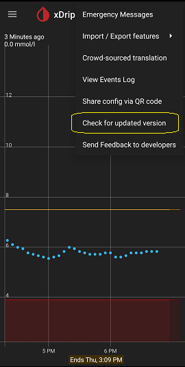

## Update xDrip  

You will need to update xDrip manually.  There is an automatic check for updates that is explained below, which informs you that an update is available.  But, there is no automatic update.  How you can verify a successful update is also explained below.  
  
  
Like any other software, an update could cause unintended behavior.  It is practically impossible to fully and adequately test a piece of software.  Some bugs will be found by users after release.  That's why releases are made in stages.  
A pre-release is a release that has only been tested by the developers.  We call it a Nightly release.  
On average, there is a Nightly release once a week.  
You can download the nightly builds (least tested but most recent), from "Releases" [here](https://github.com/NightscoutFoundation/xDrip/).  

An alpha release has been tested by a few users in the Nightly channel for a while after having been tested by developers.  
  
A beta release has been tested in the alpha channel by some users as well as in the Nightly channel by a few users as well as by the developers.  

A stable release has been tested in all the previously mentioned channels. There is about one stable release once every 6 months.  
You can download the latest stable version from "Latest" [here](https://github.com/NightscoutFoundation/xDrip/).  
  
  
    
  
| Channel | Description | 
|:--------------:|:-----------:|  
| Nightly        | Most up-to-date but least tested |  
| Alpha          | Less up-to-date but more tested than Nightly | 
| Beta           | Less up-to-date but more tested than Alpha  |  
| Stable         | Stable and Beta are usually the same |  
  
After finding the release that you want, download the file with .apk at the end and no "variant" in the title, under "Assets" and install over.  No need to uninstall first.  Installing over your existing xDrip will maintain the settings and readings history.  
To confirm that the update succeeded, view classic status page and check the first line, which shows the date of the release you have installed.  

To select which update channel is used, access Settings &#8722;> xDrip+ Update Settings.  
  
You need to choose alpha in order for the nightly option to become visible.  
To use the auto update check, enable Automatic update check.  
You may need to restart.  Now, you will be notified when there is a new release in your selected channel.  
  
Even if you don't want to use the automatic update check feature, you should choose the update channel you prefer.  
When you tap on the top right menu button on the main screen and tap on "Check for updated version", xDrip checks your selected channel only.  
  
