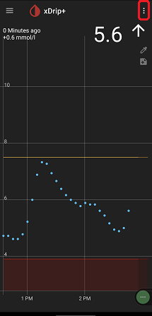
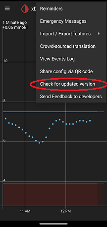

## Update xDrip  
[xDrip](../README.md) >> [Features](./Features_page.md) >> Update xDrip    
  
**Do not uninstall**  
If you uninstall, you will lose all your old readings.  Fortunately, you don't need to uninstall xDrip to install another version, which is the only way to update.  You can install a different version over your existing installation.  
   

---  

#### **Do I need to update?**  
If everything is working fine, you don't have to update.  
But, it's best to at least update to the current stable release.  
   

---  

#### **Your chosen update channel**  
From the 3-dot menu button at the top right corner of the main screen, tap on `Check for updated version`.  
  
  
  
  
  
If there has been an update in your update channel, it will be downloaded into your Download folder, and you can install it by tapping on it.  

To update to a release that is not in your update channel, please continue to read.  
  
   
  
---  
  
#### **Can I undo an update?**  
You can install an older version of xDrip over the version you currently have installed.  Therefore, you can undo an update by installing the version you had previously.    
   
  
---  
  
#### **Update channels**  
You can choose one of four update channels, Nightly (pre-release), Alpha, Beta and Stable.  
  
When you choose an update channel, you will be informed only when there is an update in that channel when you check for updates or if you enable `Automatic update check`.  
  
| Channel | Description |  
|:--------------:|:-----------: |  
| Nightly        | Most up-to-date but least tested |  
| Alpha          | Less up-to-date / more tested than Nightly |  
| Beta / Stable  | Most tested (default) |  
  
   
  
---  
  
#### **Select update channel or automatic check**  
To select an update channel, access [Main Settings](./Settings.md) &#8722;> `xDrip+ Update Settings`.  
  
You need to choose alpha in order for the nightly option to become visible.  After selecting the alpha channel, return to the main screen.  Then, go back to the Update Settings page and you will see the Nightly as an option now.  
To use the auto update check, enable Automatic update check.  
Now, you will be notified when there is a new release in your selected channel.  
   
  
---  

#### **What if I am on the alpha or beta channel, but want a feature that has been released in a Nightly?**  
You have two options.  
  
1- You can switch to the Nightly channel.  Then, tap on check for updates to get the latest Nightly release.  Later on, every time you check for updates, you will be checking the Nightly channel.  
  
2- You can install any release without changing your update channel.  
Find the release you want looking at the [release notes](./ReleaseNotes.md).  Then, tap on the corresponding link, [download](./Download-xDrip.md), and [install](./Install.md).  Later on, when you tap on check for updates, you will only get an update when there is an update in your chosen update channel.  
   

---  
  
#### **Release notes** 
[Release notes](./ReleaseNotes.md) provide a basic description for, and a link to, each release.  
   

---  
  
#### [Why nothing happens when I check for updates?](./NoUpdate.md)  
#### [How to download](./Download-xDrip.md)
#### [How to install](./Install.md)  
#### [Which version is installed?](./xDrip-Version.md)
  
