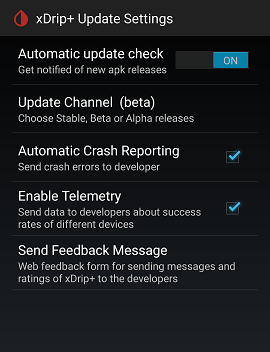

## Update xDrip  

To download xDrip, go [here](https://github.com/NightscoutFoundation/xDrip/).  
To download the latest stable version, go to "Latest".  
To access the nightly builds (least tested but more recent), go to "Releases".  
  
 
  
    

After finding the release that you want, download the file with .apk at the end, under "Assets" and install over.  No need to uninstall first.  Installing over your existing xDrip will maintain the settings and readings history.  
To confirm that the update succeeded, go to classic status page and check the first line, which shows the date of the release you have installed.  

To use the auto update check, make sure you are on the update channel you desire first.  Go to Settings - &#150 &#151 &#8722  > xDrip+ Update Settings.  
  

Enable Automatic update check.  Under update channel, choose the channel you want.  Stable has been tested the most.  Nightly has been released the latest and tested the least.  Those are the two extremes.  
You need to choose alpha in order for the nightly option to become visibale.  
You may need to restart.  Now, you will be notified when there is a new release in your selected channel.  

Even if you don't want to use the automatic update check feature, you should choose the update channel you prefer.  
When you tap on the top right menu button on the main screen and tap on "Check for updated version", xDrip checks your selected channel only.  
