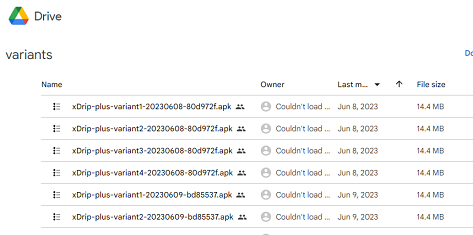
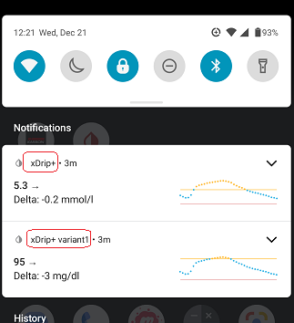
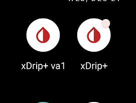

## Variants  
[xDrip](../README.md) >> [Download & Installation](./Installation_page.md) >> xDrip Variants  
  
You cannot install multiple instances of xDrip on the same phone. However, xDrip variants have different names, allowing you to install xDrip and one or more variants simultaneously. This effectively enables you to run multiple instances of xDrip on the same device, each for tracking different individuals.   
  
**Downloading Nightly Variants**  
You can download nightly variants [here](https://drive.google.com/drive/folders/0B6mvYVNVC-fOWkxnVF80dlFabjQ?resourcekey=0-ebguuiPuB1wUI9Rp2zjMNg). To view the list:  
1- Click the button at the top right to switch to list view.  
2- Click on “Last modified” at the top and select the check mark. This will add an arrow next to "Last Modified”.  
3- Click the arrow to sort by the latest version. Be patient, as the sorting process may take a moment. The latest variant will appear at the top.  
  
  
   
  
---  
  
#### **Which is which**  
   
  
- Basic notifications  
Basic notifications are identified by the name of the app, as shown in the example screenshot.  No additional action is required.  
   
   
  
- Alerts  
Name the alerts in each app according to the person you are following. For example, label the low alert in the main app as “HanselLow” and the low alert in the variant as “GretelLow.” This helps you identify which user the alert is for.   
   
  
- Icons  
Icons are clearly identified within the app, making it easy to distinguish between different instances.  
  
   
  
- Menus  
Customize the navigation bar and/or the title bar [colors](./Legend.md) to make it easier to identify which xDrip instance is currently open. This customization helps you quickly determine which app you are using.  
  
