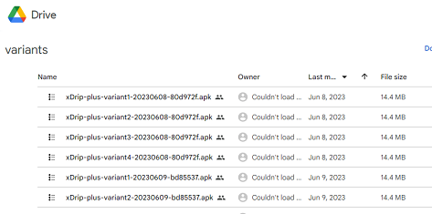
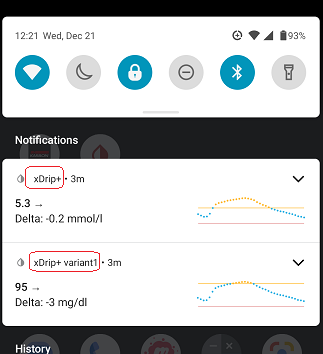
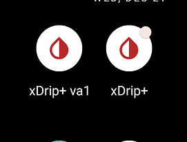

  
# Variants  
[xDrip](../) >> [Download & Installation](./Installation_page.md) >> xDrip Variants  
  
You cannot install multiple instances of the same app on a single phone. However, xDrip variants have different names, allowing you to install xDrip alongside one or more variants. This effectively lets you run multiple instances of xDrip on the same device, each dedicated to tracking a different individual.  
  
**Note:** You cannot use the xDrip in-app update mechanism to update a variant.  To update a variant, you must manually download the latest version and install it over the existing variant.  
   
  
---  
  
**Downloading Nightly Variants**  
You can download nightly variants [here](https://drive.google.com/drive/folders/0B6mvYVNVC-fOWkxnVF80dlFabjQ?resourcekey=0-ebguuiPuB1wUI9Rp2zjMNg). To view the list:  
1- Click the button at the top right to switch to list view.  
2- Click on “Last modified” at the top and select the check mark. This will add an arrow next to "Last Modified”.  
3- Click the arrow to sort by the latest version. Be patient, as the sorting process may take a moment. The latest variant will appear at the top.  
  
  
   
  
---  
  
**Downloading Stable Variants**  
Stable release variants appear alongside the main release under "Assets" in the repository.  You can browse available releases in the [release notes](./ReleaseNotes.md).  
   
  
---  
  
#### **Which is which**  
   
  
- Basic notifications  
Basic notifications are identified by the name of the app, as shown in the example screenshot.  
   
   
  
- Alerts  
Give alerts in each app names that match the person being tracked. For example, set the low alert in the main app as "HanselLow" and the low alert in the variant as "GretelLow". This makes it clear which user each alert belongs to.   
   
  
- Icons  
Each variant uses a distinct icon, making it easy to tell the different instances apart.  
  
   
  
- Menus  
Customize the navigation bar and/or the title bar [colors](./Legend.md) to quickly identify which xDrip instance is open. This makes it easier to know at a glance which app you are using.  
  
