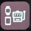

## BlueJay GTS Settings  
August 26, 2022  

  &nbsp;    &nbsp;    &nbsp;    
   
  
  &nbsp;    &nbsp;    &nbsp;   
   
  
  &nbsp;    &nbsp;    &nbsp;    &nbsp;    
   
  
  &nbsp;    &nbsp;    &nbsp;    &nbsp;    
  
