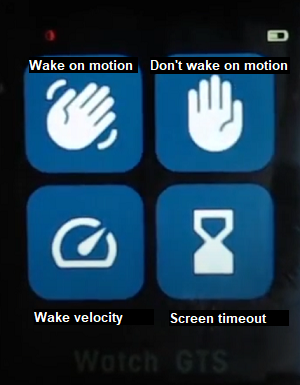
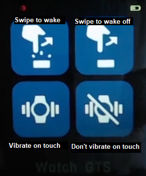
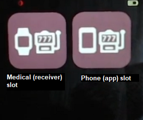
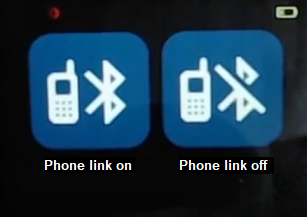

# BlueJay GTS Settings  
[xDrip](../) >> [Features](./Features_page.md) >> [Watches](./Watches.md) >> [BlueJay](./Bluejay_page.md) >> GTS Settings  

  &nbsp;    &nbsp;    &nbsp;    
   
  
  &nbsp;    &nbsp;    &nbsp;   
   
  
  &nbsp;    &nbsp;    &nbsp;    &nbsp;    
   
  
  &nbsp;    &nbsp;    &nbsp;    &nbsp;    
  
