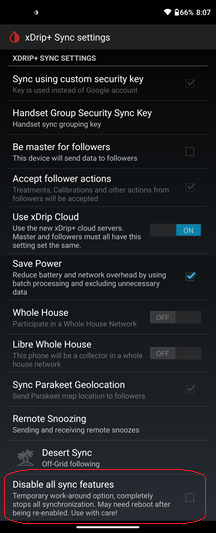

# xDrip Sync not working
[xDrip](../) >> [Troubleshooting](./Troubleshooting_page.md) >> xDrip Sync not working  
  
[Update xDrip](./Update.md) if you are using an old version.  Ensure you are using at least the the stable release.  
   
  
---  
  
Ensure `Disable all sync features` is disabled (no check mark beside it) on the master and followers.  
  
   
  
---  
  
Ensure `Hanset Group Security Sync Key` on the master matches the one on the followers.  
   
  
---  
  
The setting `Use xDrip Cloud` should be enabled on both the master and all follower devices.  
If you experience disconnects, try disabling this setting on both the master and followers, then [report the problem](./Contact.md).  
   
  
---  
  
#### [xDrip Sync setup instructions](./xDripSync.md)  
  
