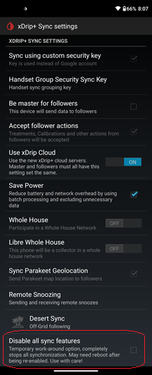
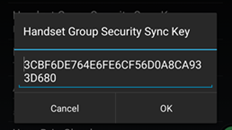

  
# xDrip Sync Troubleshooting
[xDrip](../) >> [Troubleshooting](./Troubleshooting_page.md) >> xDrip Sync not working  
   
  
[Update xDrip](./Updates.md) to ensure you are at least using the stable release.  
   
  
---  
  
Ensure `Disable all sync features` is unchecked (disabled) on both the master and all follower devices.  
  
   
  
---  
  
Tap on `Handset Group Security Sync Key` to reveal the security key.  An example is shown below:  
  
  
Keep this key private.  Ensure the key on the master matches the key on the follower(s) exactly.  If they do not match, edit one to match the other.  
   
  
---  
  
The `Use xDrip Cloud` setting should be enabled on both the master and all follower devices.  
If you experience disconnects, try disabling this setting on both the master and followers, then [report the problem](./Contact.md).  
   
  
---  
  
#### [xDrip Sync setup instructions](./xDripSync.md)  
  
