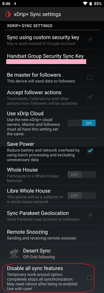

## xDrip Sync not working
[xDrip](../README.md) >> [Troubleshooting](./Troubleshooting_page.md) >> xDrip Sync not working  
  
As of July 2024, we have had to make some changes to xDrip sync because of changes that have been made to Google Cloud messaging.  
You will need to update both master and follower to an xDrip release of [2024.07.23](https://github.com/NightscoutFoundation/xDrip/releases/tag/2024.07.23) or after.  
We are aware that the sensor expiry or battery percentage and other details are not shown on the follower any longer.  
These will be fixed.  But, for now, we need to make sure everyone can use the new version for getting readings.  If we get to that point, we will address the remaining shortcomings.  
Thanks for your patience.  

If updating both master and follower does not let you get readings, please [report it](./Contact.md).  
If you need an alternative, you can use [Nightscout](./Nightscout_page.md).  
   
  
---  
  
The instructions for setting up xDrip Sync can be found [here](./xDripSync.md).  
Ensure that "Disable all sync features" is disabled (no check mark beside it) both on the master and follower.  
  
  
