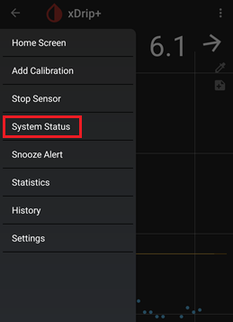

## xDrip version  
[xDrip](../README.md) >> [Download & Installation](./Installation_page.md) >> Version  
  
To get to the status pages, tap on the top left menu button and choose `System Status`.  
  
  
Now, you can swipe left or right to access different status pages.  
Each status page has a heading.  Go to the one with the "Classic Status Page" heading to see what version of xDrip you have.  
  
  
  
