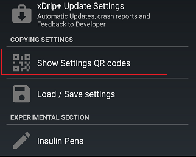
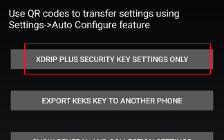
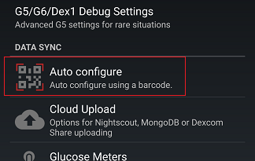
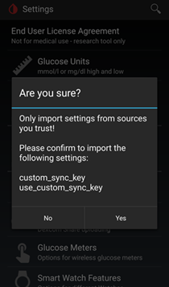
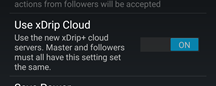
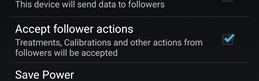

## xDrip Sync Follow  
[xDrip](../) >> [Features](./Features_page.md) >> [Follow](./Follow_page.md) >> [How to follow with xDrip](./How-to-follow.md) >> xDrip Sync  
  
This page explains how to set up xDrip Sync.  You will need both the master and follower phones.  All phones must be updated to at least the latest stable release of xDrip.  
   
  
---  

#### **Setup with QR code**    
On the master phone, go to `Settings` &#8722;> `xDrip Sync Settings`, and tap `Be Master for Followers`.  
  
Then tap `Settings` &#8722;> `Show Settings QR codes`.  
  
  
Select `xDrip plus security key settings only`.  
  
  
The QR code will now be displayed on the master phone.  
  
On the follower phone, tap `Settings` &#8722;> `Hardware Data Source` and choose `xDrip Sync Follower`.  
Then, tap `Settings` &#8722;> `Auto configure`.  
  
  
Scan the QR code shown on the master phone’s screen.  
Approve the import.  
  
  
A short video demonstration is available [here](https://youtu.be/LcgjfbYcWkE).  
  
   
  
---  

#### **Manual setup**    
If the scan does not work, you can set up the follower manually:   
Under `Settings` &#8722;> `Hardware Data Source`, select `xDrip+ Sync Follower`.  
Then, go to `Settings` &#8722;> `xDrip+ Sync Settings` and tap `Handset Group Security Sync Key`.  Make sure the key matches the one shown on the same page of the master phone.  
   
  
---  
  
#### **Use xDrip Cloud**  
Enable `Settings` &#8722;> `xDrip+ Sync Settings` &#8722;> `Use xDrip Cloud` on all phones in the group.  
  
  
See *Troubleshooting* below.  
   
  
---  
  
#### **Follower has too much control**  
By default, the follower can upload treatments to the master, calibrate it, and even stop sensor on it.  To prevent this, disable `Accept Follower Actions`.  
  
  
This option exists so a parent can control a child’s master phone if the child is too young to perform tasks like calibration. If you are the one calibrating or stopping sensors and do not want the follower to accidentally interfere, disable this setting.  
  
   
  
---  
  
#### **[Troubleshooting](./xDrip-Sync-not-working.md)**  
  
   

---  
  
[How to remove a follower](./Follow/RemoveFollower.md)  
  
