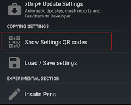

## xDrip Sync Follow  
[xDrip](../README.md) >> [Features](./Features_page.md) >> [Follow](./Follow_page.md) >> [How to follow with xDrip](./How-to-follow.md) >> xDrip Sync  
  
This page explains how to set up xDrip Sync.  You will need both the master and follower phones.  
This is easy to set up. It relies on Google.  It will need Google Play services to be on your phone.  
  
On master, go to `Settings` &#8722;> `xDrip+ Sync settings`, and tap on `Be master for followers`.  
  
By default*, the follower can upload treatments to the master, calibrate it, and even stop sensor on it.  Disable `Allow follower actions` to remove that possibility.  
  
  
Tap on `Settings` &#8722;> `Show Settings QR codes`.  
  
  
Tap on xDrip plus security key settings only.  
  
  
The QR code will now display on the master phone.  
  
On the follower phone, tap on `Settings` &#8722;> `Auto configure`.  
  
  
Scan the QR code shown on the master screen.  
Approve the import.  
  
  
This will change all the required settings, on the follower, to follow the master.  
  
All that is shown in a clip [here](https://youtu.be/LcgjfbYcWkE).  
  
In some cases, the scan does not work. You can manually set up the follower:  
Under `Settings` &#8722;> `Hardware Data Source`, select `xDrip+ Sync Follower`.  
Then, go to `Settings` &#8722;> `xDrip+ Sync Settings` and tap on `Handset Group Security Sync Key`. Make sure the key matches the key on the same page on the master.  
  
On both master and follower, ensure that `Settings` &#8722;> `xDrip+ Sync Settings` &#8722;> `Disable all sync features` is disabled (no check mark beside it).  
  
  
 
This is allowed so that a parent can have control over a child's master if the child is too young to perform functions like calibration.  

If you are the one calibrating or stopping sensors and don't need the follower to accidentally interfere, you need to disable the following setting.  
   

\* The default addresses a parent's need to control the child's master remotely.  
If you don't want your follower to have extra controls over your master xDrip, you need to disable the setting.  
  
