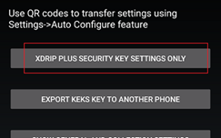
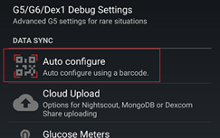

## xDrip Sync Follow  
[xDrip](../README.md) >> [Features](./Features_page.md) >> [Follow](./Follow_page.md) >> [How to follow with xDrip](./How-to-follow.md) >> xDrip Sync  
  
This page explains how to set up xDrip Sync.  You will need both the master and follower phones.    
   
  
---  

#### **Setup with QR code**    
On the master phone, go to `Settings` &#8722;> `xDrip Sync Settings`, and tap on `Be Master for Followers`.  
  
Tap on `Settings` &#8722;> `Show Settings QR codes`.  
  
  
Tap on xDrip plus security key settings only.  
  
  
The QR code will now display on the master phone.  
  
On the follower phone, tap on `Settings` &#8722;> `Hardware Data Source` and choose `xDrip Sync Follower`.  
Then, tap on `Settings` &#8722;> `Auto configure`.  
  
  
Scan the QR code shown on the master screen.  
Approve the import.  
  
  
All of this is shown in a clip [here](https://youtu.be/LcgjfbYcWkE).  
   
  
---  

#### **Manual setup**    
In some cases, the scan may not work. You can manually set up the follower:   
Under `Settings` &#8722;> `Hardware Data Source`, select `xDrip+ Sync Follower`.  
Then, go to `Settings` &#8722;> `xDrip+ Sync Settings` and tap on `Handset Group Security Sync Key`.  Make sure the key matches the key on the same page on the master.  
   
  
---  
  
#### **Follower has too much control**  
By default, the follower can upload treatments to the master, calibrate it, and even stop sensor on it.  To remove this possibility, disable `Allow Follower Actions`.  
  
  
This feature is allowed so that a parent can have control over a child’s master if the child is too young to perform functions like calibration. If you are the one calibrating or stopping sensors and don’t want the follower to accidentally interfere, you need to disable this setting.  
  
   
  
---  
  
#### **Malfunction**  
On both the master and follower, ensure that `Settings` &#8722;> `xDrip+ Sync Settings` &#8722;> `Disable All Sync Features` is disabled (no checkmark beside it).   
  

The `Use xDrip Cloud` setting should be the same on all phones in the group. It should either be enabled on all phones or disabled on all phones.   
   

---  
  
[How to remove a follower](./Follow/RemoveFollower.md)  
  
